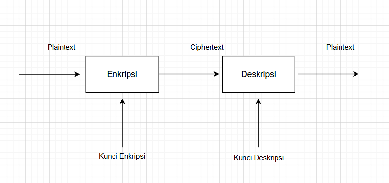

# Laporan Praktikum Kriptografi
Minggu ke-: 2 
Topik:cryptosystem  
Nama: Anom Pangestu 
NIM: 230320553  
Kelas: 5DSRA 

---

## 1. Tujuan
1. Mengidentifikasi komponen dasar kriptosistem (plaintext, ciphertext, kunci, algoritma).  
2. Menggambarkan proses enkripsi dan dekripsi sederhana.  
3. Mengklasifikasikan jenis kriptosistem (simetris dan asimetris).  

---

## 2. Dasar Teori
Kriptosistem adalah sistem yang digunakan untuk melindungi informasi melalui proses penyandian (enkripsi) dan pembukaan sandi (dekripsi). Dalam kriptosistem, data asli yang disebut plaintext diubah menjadi bentuk tidak terbaca yang disebut ciphertext menggunakan suatu algoritma kriptografi dan kunci tertentu. Proses ini bertujuan agar pesan tidak dapat dibaca atau dimengerti oleh pihak yang tidak berwenang selama proses pengiriman atau penyimpanan data.

Kunci berperan penting dalam proses enkripsi dan dekripsi karena menentukan hasil perubahan plaintext menjadi ciphertext dan sebaliknya. Dalam kriptografi, terdapat dua jenis sistem kunci, yaitu kriptografi simetris yang menggunakan satu kunci yang sama untuk enkripsi dan dekripsi, serta kriptografi asimetris yang menggunakan sepasang kunci berbeda (kunci publik dan kunci privat). Tanpa kunci yang benar, ciphertext tidak dapat dikembalikan ke bentuk aslinya.

Dengan demikian, kriptosistem merupakan gabungan dari algoritma dan kunci yang bekerja sama untuk menjaga kerahasiaan, keaslian, dan integritas informasi. Melalui proses enkripsi, data menjadi aman dari pihak yang tidak berhak, sementara proses dekripsi memungkinkan penerima yang sah untuk membaca kembali pesan dalam bentuk aslinya.

## 3. Alat dan Bahan
- VISUAL CODE STUDIO

---

## 4. Langkah Percobaan

1. Membuat diagram kripto sistem di folder `praktikum/week2-cryptosystem/screenshoot/`.

2. Menyalin kode program dari panduan praktikum.
3. Menjalankan program simple_crypto.py`.

---
## 5. Source Code

def encrypt(plaintext, key):
    result = ""
    for char in plaintext:
        if char.isalpha():
            shift = 65 if char.isupper() else 97
            result += chr((ord(char) - shift + key) % 26 + shift)
        else:
            result += char
    return result

---

## 6. Hasil dan Pembahasan

A. Komponen Kriptosistem

Kriptosistem terdiri dari beberapa komponen utama yang bekerja bersama untuk menjaga keamanan data selama proses komunikasi. Komponen-komponen tersebut meliputi:
1.Plaintext
Merupakan pesan asli atau data yang belum dienkripsi. Plaintext adalah informasi yang dapat dibaca oleh manusia atau sistem sebelum proses enkripsi dilakukan.
2.Ciphertext
Adalah hasil dari proses enkripsi terhadap plaintext. Ciphertext berbentuk kode atau data yang tidak dapat dibaca secara langsung tanpa melalui proses dekripsi.
3.Algoritma Enkripsi dan Dekripsi
Algoritma enkripsi digunakan untuk mengubah plaintext menjadi ciphertext, sedangkan algoritma dekripsi berfungsi membalikkan ciphertext kembali menjadi plaintext. Kedua algoritma ini menentukan seberapa kuat keamanan sistem.
4.Kunci (Key)
Kunci digunakan sebagai parameter penting dalam proses enkripsi dan dekripsi. Dalam kriptografi simetris, kunci yang digunakan sama, sedangkan dalam kriptografi asimetris digunakan pasangan kunci publik dan privat.
Dengan kata lain, kriptosistem bekerja dengan cara mengubah pesan asli (plaintext) menjadi bentuk terenkripsi (ciphertext) menggunakan algoritma dan kunci tertentu, lalu pesan tersebut dapat dikembalikan ke bentuk semula melalui proses dekripsi menggunakan kunci yang sesuai.

B. Penjelasan perbedaan simetris vs asimetris. 

Kriptografi simetris dan asimetris merupakan dua pendekatan utama dalam sistem enkripsi data yang memiliki perbedaan mendasar pada cara penggunaan kuncinya.
Pada kriptografi simetris, proses enkripsi dan dekripsi menggunakan kunci yang sama. Artinya, pengirim dan penerima pesan harus memiliki kunci rahasia yang identik untuk dapat saling bertukar data secara aman. Kelebihan utama metode ini adalah prosesnya cepat dan efisien, sehingga sering digunakan untuk enkripsi dalam jumlah besar. Namun, kelemahannya terletak pada distribusi kunci yang harus dilakukan secara aman agar tidak bocor ke pihak lain.
Contoh algoritma kriptografi simetris antara lain AES (Advanced Encryption Standard) dan DES (Data Encryption Standard).

Sementara itu, pada kriptografi asimetris, digunakan dua kunci berbeda tetapi saling berhubungan, yaitu kunci publik (public key) untuk enkripsi dan kunci privat (private key) untuk dekripsi. Kunci publik dapat dibagikan secara bebas, sementara kunci privat harus dijaga kerahasiaannya. Keunggulan utama metode ini adalah tingkat keamanannya yang tinggi dalam pertukaran kunci, namun memiliki kelemahan dari sisi kecepatan, karena proses enkripsinya lebih kompleks.
Contoh algoritma kriptografi asimetris antara lain RSA (Rivest–Shamir–Adleman) dan ECC (Elliptic Curve Cryptography).

---

## 7. Jawaban Pertanyaan

- Pertanyaan 1:Plaintext, Ciphertext, Algoritma, dan Kunci.
- Pertanyaan 2: Kelebihan sistem simetris adalah proses enkripsi dan dekripsi lebih cepat serta efisien untuk data besar. Kelemahannya adalah distribusi kunci harus dilakukan dengan aman karena menggunakan satu kunci yang sama.
Sementara itu, sistem asimetris lebih aman dalam pertukaran kunci karena menggunakan kunci publik dan privat, tetapi prosesnya lebih lambat dan membutuhkan sumber daya komputasi yang lebih besar.
- Pertanyaan 3 : Distribusi kunci menjadi masalah utama dalam kriptografi simetris karena pengirim dan penerima harus menggunakan kunci yang sama, sehingga kunci tersebut harus dikirim atau dibagikan terlebih dahulu dengan cara yang aman. Jika kunci tersebut disadap atau bocor selama proses distribusi, maka pihak tidak berwenang dapat mendekripsi pesan dan keamanan sistem menjadi hilang.
---

## 8. Kesimpulan

Kriptosistem merupakan suatu mekanisme penting dalam menjaga keamanan informasi dengan cara menyandikan data asli (plaintext) menjadi bentuk terenkripsi (ciphertext) menggunakan algoritma dan kunci tertentu. Melalui proses enkripsi dan dekripsi, data dapat terlindungi dari pihak yang tidak berwenang selama proses pengiriman atau penyimpanan.

Peran kunci dalam kriptografi sangat vital karena menentukan hasil proses penyandian dan pembukaan sandi. Pada sistem simetris, satu kunci yang sama digunakan untuk enkripsi dan dekripsi, sedangkan pada sistem asimetris digunakan dua kunci berbeda, yaitu kunci publik dan kunci privat. Masing-masing memiliki kelebihan dan kelemahan, di mana kriptografi simetris lebih cepat namun memiliki risiko pada distribusi kunci, sedangkan kriptografi asimetris lebih aman dalam pertukaran kunci tetapi lebih lambat dalam prosesnya.

Dengan memahami cara kerja, komponen, serta jenis kriptosistem, diharapkan pengguna dapat memilih metode yang tepat sesuai kebutuhan keamanan data, sehingga kerahasiaan dan integritas informasi tetap terjaga dengan baik.


---
## 9. Commit Log
(Tuliskan bukti commit Git yang relevan.  
Contoh:
```
commit abc12345
Author: Nama Mahasiswa <anompangestu16@gmail.com>
Date:   2025-20-14

    week2-cryptosystem: implementasi Caesar Cipher dan laporan )
```
